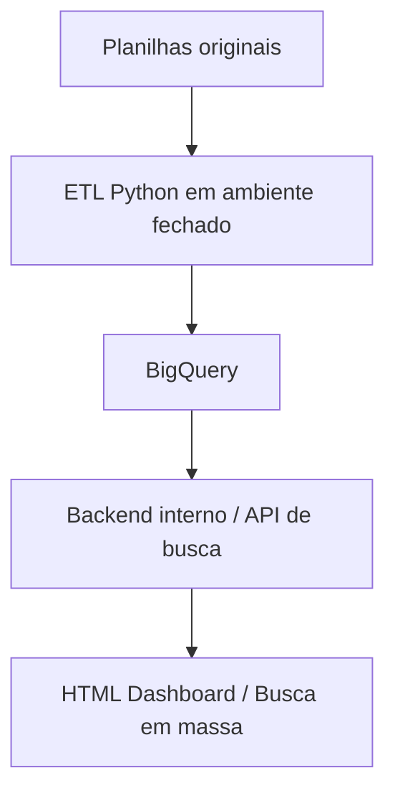
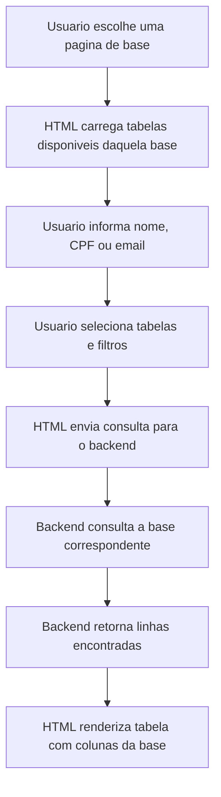
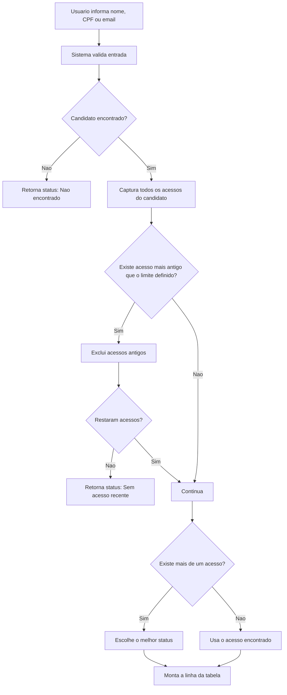

# Documentacao do Projeto de Busca de Candidatos

## 1. Visao geral

O Projeto de Busca de Candidatos tem como objetivo facilitar a consulta de candidatos em varias bases usadas pela equipe. A proposta e simular, em uma interface web, funcoes parecidas com o "Localizar" e o "PROCV/PROC" do Excel, mas com maior capacidade de processamento, busca em massa e suporte a diferentes tipos de identificador.

O sistema deve permitir pesquisar candidatos por:

- Nome
- CPF
- Email

O resultado esperado e uma tabela centralizada na tela, semelhante a uma planilha, com opcoes de filtro, copia de tabela e acesso rapido aos links das abas onde os candidatos foram encontrados.

## 2. Fontes analisadas

Esta documentacao foi criada a partir dos arquivos existentes no projeto:

- `# Projeto de busca de candidatos.txt`
- `# HTML.txt`
- `# UNICO.txt`
- `Fluxograma/Captura de pantalla 2026-07-30 100231.png`
- `Fluxograma/Captura de pantalla 2026-07-30 100458.png`
- `Fluxograma/Captura de pantalla 2026-07-30 100526.png`

As imagens da pasta `Fluxograma` detalham a logica da API UNICO, a priorizacao de status e o modelo esperado de tabela.

## 3. Arquitetura geral

Fluxo previsto do projeto:



### 3.1 Planilhas originais

Sao as bases atuais usadas pela equipe. Elas alimentam o processo de ETL e representam as fontes onde os candidatos podem ser encontrados.

### 3.2 ETL Python

Camada responsavel por extrair os dados das planilhas, tratar e carregar as informacoes em uma base consolidada.

Responsabilidades previstas:

- Ler planilhas originais.
- Identificar abas disponiveis.
- Extrair registros de candidatos.
- Padronizar campos como nome, CPF e email.
- Gerar dados consolidados.
- Atualizar tabelas no BigQuery.

### 3.3 BigQuery

Banco de dados analitico previsto para armazenar os dados tratados.

As bases possuem estruturas de colunas diferentes. Por isso, a separacao principal do HTML deve seguir os tipos de base, e nao uma unica tabela consolidada para todas as origens.

Bases/tabelas previstas para conexao com o HTML:

- `Consolidado`
- `Perifericos`
- `Processos Seletivos SP`
- `Processo Online`
- `GO Live & Takeover`

Cada base deve manter sua propria estrutura de colunas. A normalizacao de busca por CPF, nome e email pode existir no backend, mas a exibicao final deve respeitar as colunas da base selecionada.

### 3.4 Backend interno

Camada responsavel por receber as requisicoes do dashboard, consultar o BigQuery ou a API externa da UNICO e devolver os resultados para o HTML.

Responsabilidades previstas:

- Expor endpoints de busca.
- Aplicar filtros recebidos pela interface.
- Consultar bases internas.
- Consultar a endpoint da UNICO quando necessario.
- Padronizar respostas em formato tabular.
- Controlar erros e mensagens para o usuario.

### 3.5 HTML Dashboard

Interface usada pela equipe para realizar buscas. Deve conter paginas para cada base, filtros, campo de consulta, botao de consultar, limpeza da consulta, copia de tabela e visualizacao dos resultados. Como cada base possui colunas diferentes, cada pagina deve carregar somente as tabelas e os campos correspondentes a sua propria base.

## 4. Estrutura de paginas do HTML

O HTML deve possuir 8 paginas:

- Home
- Documentacao
- GO Live & Takeover
- Processos Seletivos SP
- Perifericos
- Processo Online
- Consolidado
- UNICO People

### 4.1 Home

Pagina principal do sistema. Deve apresentar acesso as paginas de base e manter os links de Home e Documentacao no canto superior direito.

### 4.2 Documentacao

Pagina de ajuda para explicar o funcionamento do sistema e apresentar um tutorial simples de uso.

### 4.3 Paginas de base

As paginas de base sao:

- GO Live & Takeover
- Processos Seletivos SP
- Perifericos
- Processo Online
- Consolidado
- UNICO People

As cinco bases internas ficam separadas em paginas porque cada uma possui suas proprias tabelas e colunas:

- `Consolidado`
- `Perifericos`
- `Processos Seletivos SP`
- `Processo Online`
- `GO Live & Takeover`

Cada pagina de base interna deve ter:

- Bloco de consulta para inserir nome, CPF ou email.
- Filtros selecionaveis.
- Botao `Consultar`.
- Botao para limpar a consulta.
- Tabela de resultados.
- Botao `Copiar tabela`.

A pagina `UNICO People` segue fluxo proprio, pois consulta a endpoint da UNICO e nao as tabelas internas.

## 5. Regras da interface

### 5.1 Campo de consulta

O campo de consulta deve aceitar um ou varios valores, como CPFs, nomes ou emails.

Uso esperado:

- O usuario cola ou digita os candidatos no campo.
- O usuario escolhe os filtros desejados.
- O usuario clica em `Consultar`.
- O sistema exibe os resultados em tabela.

### 5.2 Botao de limpeza

O botao `X` dentro do campo de busca deve apagar o conteudo digitado.

Exemplo:

1. O usuario cola varios CPFs.
2. Clica em `Consultar`.
3. Depois clica no `X`.
4. O campo de consulta fica vazio.

### 5.3 Filtros selecionaveis

Os filtros devem abrir opcoes com caixas de selecao.

#### Selecione as tabelas

As opcoes deste filtro devem ser geradas a partir das tabelas/abas disponiveis dentro da base atual. O usuario primeiro escolhe a pagina da base, e dentro dela escolhe quais tabelas daquela base deseja consultar.

Regras:

- A opcao `Todas as tabelas` seleciona todas as demais opcoes automaticamente.
- As demais opcoes correspondem aos nomes das tabelas ou abas daquela base.
- Nao deve misturar tabelas de bases diferentes no mesmo filtro, porque as colunas podem ser diferentes.

#### Tipos

Opcoes:

- Todos
- Nome
- CPF
- Email

#### Status

Opcoes gerais:

- Todos
- Nao encontrado
- Encontrado

#### Colunas

Opcoes:

- Todas as colunas
- Resumo

#### Status da pagina UNICO People

Opcoes:

- Todos
- Arquivado
- Em analise
- Pendente

#### Data limite de busca

Filtro exclusivo da pagina UNICO People.

Deve funcionar como um controle de faixa ou selecao rapida, com as opcoes:

- 30 dias
- 90 dias
- 180 dias
- 365 dias

Este filtro deve ficar abaixo do bloco `Adicionar credencial`.

### 5.4 Tabela de resultados

A tabela deve aparecer no lado direito, centralizada, com comportamento visual parecido com uma planilha.

Requisitos:

- As celulas devem ser selecionaveis como no Excel.
- O usuario deve conseguir copiar todas as colunas pelo botao `Copiar tabela`.
- O resultado deve respeitar os filtros aplicados.
- Nas bases internas, a tabela exibida deve seguir as colunas reais da base consultada.
- O HTML nao deve tentar forcar uma estrutura unica de colunas para todas as bases.

Modelo esperado para a pagina UNICO:

| Nome | CPF | Email | Telefone | Pendencias | Data limite | Numero de ocorrencias |
| --- | --- | --- | --- | --- | --- | --- |
| Exemplo Nome | 12345678900 | exemplo@email.com | 11999999999 | PIS; Exame admissional | 31/07/2026 | 1 |

### 5.5 Link da aba

Quando existir a coluna `Link da aba`, a interface nao deve mostrar a URL diretamente.

Na tela:

- Exibir um botao chamado `Abrir link`.
- Ao clicar, abrir diretamente a aba onde o candidato foi encontrado.

Ao copiar a tabela:

- A copia deve conter o link real.
- Nao deve copiar o texto `Abrir link`.

## 6. Pagina UNICO People

A pagina UNICO People possui regras diferentes porque consulta dados atraves de uma endpoint da UNICO.

Endpoint informada:

```text
https://admin.acessorh.com.br/svc2/search/people?account
```

### 6.1 Credencial

A pagina UNICO deve ter um bloco para adicionar a credencial de login/token.

Regras de erro:

- Se o usuario tentar consultar sem credencial, exibir:

```text
Para a requisicao de busca, adicione a credencial. Caso tenha duvida de como proceder, entre na nossa pagina de Documentacao
```

- Se o campo estiver preenchido, mas nao for uma credencial valida, exibir:

```text
Credencial nao encontrada, tente novamente
```

### 6.2 Limites de requisicao

O consumo da API UNICO deve respeitar:

- Maximo de 15 requisicoes por segundo.
- Maximo de 2000 requisicoes por execucao.

### 6.3 Campos retornados

A API deve alimentar a tabela com:

- Nome
- CPF
- Email
- Status
- Pendencias
- Data limite
- Numero de ocorrencias

Campos do JSON usados:

- Nome: `candidate.name`
- CPF: `candidate.identifier.value`
- Email: `candidate.email`
- Telefone: `candidate.mobile.countryCode` + `candidate.mobile.number`
- Status: `status.overview.code` e `status.overview.total`
- Pendencias: `documentList`
- Data limite: `limitDate`
- Numero de ocorrencias: `result.admissions.total`

### 6.4 Regra de status

Mapeamento previsto:

| Campo `status.overview.code` | Total | Status exibido |
| --- | ---: | --- |
| `archived` | Qualquer | Arquivado |
| `completed` | Qualquer | Mesa de analise |
| `pending` | 2 | Pendente |
| `pending` | 1 | Nao iniciado |

Quando houver mais de um acesso do mesmo candidato na UNICO, o sistema deve escolher o melhor status encontrado.

Ordem de escolha:

1. Arquivado
2. Mesa de analise
3. Pendente
4. Nao iniciado

### 6.5 Regra de pendencias

Tipos de documentos monitorados:

- RG
- CPF
- Comprovante de escolaridade
- Comprovante de Endereco
- Foto do cracha
- Certidao de Nascimento
- Certidao de Casamento
- Dependentes
- Certidao de divorcio
- Beneficios
- PIS
- Exame admissional
- Informacoes Pessoais

Regras:

- A verificacao de pendencias deve ocorrer apenas para candidatos com status `Pendente`.
- Se um documento tiver `code` diferente de `220`, ele deve entrar na coluna `Pendencias`.
- Se um documento tiver `exist` igual a `false`, ele tambem deve entrar na coluna `Pendencias`.
- As pendencias devem ser exibidas em sequencia, separadas por ponto e virgula.

Exemplo:

```text
PIS; Beneficios; Exame admissional
```

Regras por status:

| Status | Valor da coluna `Pendencias` |
| --- | --- |
| Arquivado | Em branco |
| Mesa de analise | Assinatura de documento |
| Pendente | Lista de documentos pendentes |
| Nao iniciado | Todos os documentos |

### 6.6 Regra de data

O campo `limitDate` deve ser convertido para o formato brasileiro:

```text
dd/mm/yyyy
```

Exemplo:

```text
2022-03-11T00:00:00Z -> 11/03/2022
```

### 6.7 Regra de ocorrencias

A coluna `Numero de ocorrencias` deve usar o total retornado em:

```text
result.admissions.total
```

## 7. Logica de busca

### 7.1 Bases internas

Nas bases internas, a busca deve funcionar como uma comparacao direta com as planilhas. Com excecao da UNICO People, nao havera tratamento de duplicados.

Regras:

- Cada pagina consulta apenas as tabelas da sua propria base.
- A busca compara os valores informados com as colunas correspondentes de nome, CPF ou email.
- Se o mesmo candidato aparecer mais de uma vez na base, o HTML deve retornar as linhas encontradas conforme estao nas tabelas.
- O resultado deve preservar as colunas da base consultada.
- A conexao entre as tabelas e o HTML deve ser feita pelo backend/API interna, que entrega os dados ja filtrados para a interface.
- A logica deve reaproveitar o comportamento do programa antigo: normalizacao de CPF, email e nome; filtro de tabelas; modo resumo/todas as colunas; copia em formato de planilha; e links exibidos como botao `Abrir link`.

Fluxo esperado para bases internas:



### 7.2 UNICO People

Fluxo esperado da busca UNICO:



## 8. Tutorial simples de uso

### 8.1 Funcionalidades disponiveis nesta etapa

As paginas liberadas para teste sao:

- `Home`: apresenta todas as bases previstas e o estado atual do sistema.
- `Documentacao`: contem o tutorial operacional.
- `UNICO People`: consulta CPF, nome ou email na integracao UNICO.

As paginas das bases internas permanecem identificadas como `Em preparacao` ate
a etapa de validacao da conexao com o BigQuery.

Para iniciar o sistema, execute o backend e abra `http://127.0.0.1:8000`. Antes
da primeira consulta, configure `UNICO_ACCOUNT_ID` e `UNICO_TENANT` no arquivo
`backend/.env`. A credencial de autorizacao e informada na tela apenas no
momento da consulta e nao e salva pelo navegador.

### 8.2 Como pesquisar candidatos nas bases internas

1. Abra o dashboard HTML.
2. Na Home, escolha a pagina da base desejada, por exemplo `Consolidado`, `Perifericos`, `Processos Seletivos SP`, `Processo Online` ou `GO Live & Takeover`.
3. No campo de busca, digite ou cole os nomes, CPFs ou emails dos candidatos.
4. Abra o filtro `Tipos` e selecione se a busca sera por `Nome`, `CPF`, `Email` ou `Todos`.
5. Se necessario, use o filtro `Selecione as tabelas` para escolher tabelas/abas especificas daquela base.
6. Clique em `Consultar`.
7. Veja os resultados na tabela.
8. Para abrir a origem do registro, clique em `Abrir link` na coluna `Link da aba`.
9. Para levar o resultado para uma planilha, clique em `Copiar tabela` e cole no Excel ou Google Sheets.

### 8.3 Como pesquisar na UNICO People

1. Abra a pagina `UNICO People`.
2. Cole a credencial/token no campo `Credencial`.
3. Escolha a data limite de busca: `30`, `90`, `180` ou `365` dias.
4. Digite ou cole nomes, CPFs ou emails no campo de consulta.
5. Selecione os filtros desejados, como tipo de busca e status.
6. Clique em `Consultar`.
7. Aguarde o retorno da API.
8. Confira na tabela o nome, CPF, email, status, pendencias, data limite e numero de ocorrencias.
9. Use `Copiar tabela` para copiar todas as colunas.

### 8.4 Como limpar uma consulta

1. Clique no `X` dentro do campo de busca.
2. O conteudo digitado sera apagado.
3. Insira uma nova busca, se necessario.

### 8.5 Como interpretar os resultados

Status gerais:

- `Encontrado`: candidato localizado na base selecionada.
- `Nao encontrado`: candidato nao localizado.
- `Sem acesso recente`: candidato existe, mas nao possui acesso dentro do periodo escolhido.

Status da UNICO:

- `Arquivado`: processo arquivado.
- `Em analise`: processo concluido e em analise/assinatura.
- `Pendente`: candidato possui documentos pendentes.
- `Nao iniciado`: candidato ainda nao iniciou o envio dos documentos.

Pendencias:

- Campo vazio: nao ha pendencia relevante para aquele status.
- `Assinatura de documento`: candidato em mesa de analise.
- Lista de documentos: candidato esta pendente e precisa enviar ou corrigir os itens listados.
- `Todos os documentos`: candidato nao iniciou o processo.

## 9. Requisitos funcionais

- Permitir busca por nome, CPF e email.
- Permitir busca em massa.
- Separar as bases internas em paginas proprias: `Consolidado`, `Perifericos`, `Processos Seletivos SP`, `Processo Online` e `GO Live & Takeover`.
- Permitir filtros por tabela/aba da base atual, tipo, status e colunas.
- Permitir filtro de data na pagina UNICO.
- Exibir resultados em tabela semelhante a planilha.
- Exibir as colunas reais de cada base, sem obrigar todas as paginas a usarem o mesmo formato de tabela.
- Permitir selecao de celulas.
- Copiar todas as colunas da tabela.
- Exibir botao `Abrir link` para URLs de abas.
- Copiar URL real ao copiar a tabela.
- Validar credencial obrigatoria na pagina UNICO.
- Tratar credencial invalida.
- Respeitar limite de requisicoes da API UNICO.
- Converter datas para `dd/mm/yyyy`.
- Calcular numero de ocorrencias.
- Identificar e exibir pendencias conforme regras de status.

## 10. Requisitos nao funcionais

- Interface simples e objetiva para uso operacional.
- Busca mais rapida e robusta que a consulta manual em planilhas.
- Estrutura preparada para crescimento de volume.
- Separacao entre dados, backend e frontend.
- Mensagens de erro claras para usuarios.
- Resultado facil de copiar para planilhas.

## 11. Backlog atual

Itens ja marcados como concluidos nos documentos originais:

- Design do HTML.
- Logica da busca UNICO.

Itens ainda pendentes nos documentos originais:

- Estrutura de todo o projeto.
- Documentacao.
- Conexao entre banco de dados e HTML.
- Estruturacao das APIs.
- Testes.
- Funcionalidades do HTML.

## 12. Sugestao de proximas etapas tecnicas

1. Definir o nome final do projeto.
2. Criar estrutura de pastas para `frontend`, `backend`, `etl` e `docs`.
3. Definir o contrato de conexao entre backend e HTML para cada base.
4. Implementar a API interna de busca para `Consolidado`, `Perifericos`, `Processos Seletivos SP`, `Processo Online` e `GO Live & Takeover`.
5. Implementar no HTML o carregamento dinamico das tabelas/abas de cada base.
6. Implementar o dashboard HTML com as 8 paginas.
7. Implementar a integracao UNICO com controle de token e limites de requisicao.
8. Criar testes de busca, filtros, copia de tabela e tratamento de erros.
9. Publicar a pagina de Documentacao dentro do dashboard.

## 13. Criterios de aceite

O projeto pode ser considerado funcional quando:

- O usuario consegue buscar um ou varios candidatos por CPF, nome ou email.
- A consulta retorna resultados corretos por base.
- Cada pagina interna consulta apenas as tabelas da sua propria base.
- Cada base exibe suas proprias colunas no HTML.
- Os filtros alteram corretamente a tabela.
- O botao `X` limpa a consulta.
- O botao `Copiar tabela` copia todas as colunas.
- Links de abas aparecem como `Abrir link` na tela e como URL real na copia.
- A pagina UNICO exige credencial antes de consultar.
- Credenciais invalidas geram mensagem de erro.
- Status e pendencias da UNICO seguem as regras documentadas.
- Datas aparecem em formato `dd/mm/yyyy`.
- A interface possui Home, Documentacao e as seis paginas de base.
