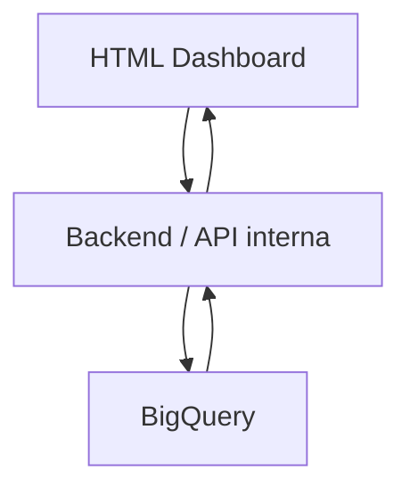
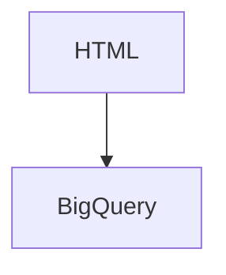

# Conexao BigQuery com HTML

## Ideia principal

O HTML nao deve se conectar diretamente ao BigQuery.

O fluxo correto e:



Motivo:

- O HTML roda no navegador do usuario.
- O BigQuery precisa de credenciais de servico.
- Credenciais nao devem ficar dentro do HTML.
- O backend controla filtros, busca, erros e formato da resposta.
- O HTML recebe apenas os dados prontos para exibir.

## Como fica na pratica

Quando o usuario abre uma pagina, por exemplo `Consolidado`:

1. O HTML chama o backend:

```text
GET /bases/consolidado
```

2. O backend consulta/configura os metadados da base:

- tabelas disponiveis
- colunas disponiveis
- colunas pesquisaveis
- colunas de resumo
- coluna de link, se existir

3. O HTML monta os filtros da tela.

4. O usuario cola CPFs, nomes ou emails e clica em `Consultar`.

5. O HTML chama:

```text
POST /search/consolidado
```

6. O backend monta a consulta SQL no BigQuery.

7. O BigQuery retorna as linhas encontradas.

8. O backend padroniza o retorno.

9. O HTML renderiza a tabela.

## Responsabilidade de cada parte

### HTML

Responsavel por:

- Mostrar paginas.
- Mostrar filtros.
- Receber a consulta do usuario.
- Enviar requisicao para o backend.
- Renderizar resultados.
- Copiar tabela.
- Exibir `Abrir link` no lugar da URL.

O HTML nao deve:

- Guardar credencial do BigQuery.
- Rodar SQL.
- Saber detalhes internos das tabelas.
- Carregar todas as bases de uma vez.

### Backend/API interna

Responsavel por:

- Receber requisicoes do HTML.
- Validar base solicitada.
- Normalizar CPF, email e nome.
- Montar SQL para o BigQuery.
- Consultar BigQuery.
- Tratar erros.
- Retornar dados em JSON para o HTML.

### BigQuery

Responsavel por:

- Armazenar tabelas das bases.
- Executar consultas.
- Retornar linhas encontradas.

## Bases internas

As bases internas sao:

- `Consolidado`
- `Perifericos`
- `Processos Seletivos SP`
- `Processo Online`
- `GO Live & Takeover`

Cada base deve ter sua propria pagina no HTML e sua propria configuracao no backend.

## Configuracao recomendada por base

O backend deve ter um mapa de configuracao parecido com este:

```json
{
  "consolidado": {
    "nome": "Consolidado",
    "dataset": "busca_candidatos",
    "tabelas": [
      {
        "id": "consolidado_principal",
        "nome": "Consolidado Principal",
        "bigquery_table": "projeto.busca_candidatos.consolidado_principal",
        "cpfColumn": "CPF",
        "nameColumn": "NOME COMPLETO",
        "emailColumn": "E-MAIL",
        "linkColumn": "Link da aba",
        "summaryColumns": ["Nome da planilha", "Link da aba", "NOME COMPLETO", "CPF", "E-MAIL", "STATUS"]
      }
    ]
  }
}
```

Esse mapa permite que o HTML seja dinamico. Ele nao precisa saber as colunas antes; ele pergunta ao backend.

## Endpoint de metadados

Endpoint:

```text
GET /bases/{base}
```

Exemplo:

```text
GET /bases/consolidado
```

Resposta:

```json
{
  "base": "consolidado",
  "nome": "Consolidado",
  "tabelas": [
    {
      "id": "consolidado_principal",
      "nome": "Consolidado Principal",
      "colunas": [
        { "id": "Nome da planilha", "rotulo": "Nome da planilha" },
        { "id": "Link da aba", "rotulo": "Link da aba", "tipo": "link" },
        { "id": "NOME COMPLETO", "rotulo": "NOME COMPLETO" },
        { "id": "CPF", "rotulo": "CPF" },
        { "id": "E-MAIL", "rotulo": "E-MAIL" },
        { "id": "STATUS", "rotulo": "STATUS" }
      ],
      "colunas_resumo": ["Nome da planilha", "Link da aba", "NOME COMPLETO", "CPF", "E-MAIL", "STATUS"]
    }
  ]
}
```

## Endpoint de busca

Endpoint:

```text
POST /search/{base}
```

Exemplo:

```text
POST /search/consolidado
```

Payload:

```json
{
  "tipo": "cpf",
  "entradas": ["12345678900", "98765432100"],
  "tabelas": ["consolidado_principal"],
  "modo_colunas": "resumo"
}
```

Resposta:

```json
{
  "base": "consolidado",
  "total_consultado": 2,
  "total_encontrado": 1,
  "colunas": ["Consulta", "Tipo", "Resultado", "Tabela", "Linha", "Nome da planilha", "Link da aba", "NOME COMPLETO", "CPF", "E-MAIL", "STATUS"],
  "resultados": [
    {
      "Consulta": "12345678900",
      "Tipo": "CPF",
      "Resultado": "Encontrado",
      "Tabela": "Consolidado Principal",
      "Linha": 25,
      "Nome da planilha": "Consolidado",
      "Link da aba": "https://...",
      "NOME COMPLETO": "Nome Exemplo",
      "CPF": "12345678900",
      "E-MAIL": "exemplo@email.com",
      "STATUS": "Ativo"
    },
    {
      "Consulta": "98765432100",
      "Tipo": "CPF",
      "Resultado": "Nao encontrado",
      "Tabela": "",
      "Linha": "",
      "Nome da planilha": "",
      "Link da aba": "",
      "NOME COMPLETO": "",
      "CPF": "",
      "E-MAIL": "",
      "STATUS": ""
    }
  ]
}
```

## Exemplo de SQL por CPF

O backend recebe:

```json
{
  "tipo": "cpf",
  "entradas": ["12345678900"]
}
```

E monta uma consulta parametrizada:

```sql
SELECT
  *
FROM `projeto.busca_candidatos.consolidado_principal`
WHERE REGEXP_REPLACE(CAST(CPF AS STRING), r'[^0-9]', '') IN UNNEST(@cpfs)
```

O parametro `@cpfs` recebe:

```json
["12345678900"]
```

## Exemplo de SQL por email

```sql
SELECT
  *
FROM `projeto.busca_candidatos.consolidado_principal`
WHERE LOWER(TRIM(CAST(`E-MAIL` AS STRING))) IN UNNEST(@emails)
```

## Exemplo de SQL por nome

Busca simples:

```sql
SELECT
  *
FROM `projeto.busca_candidatos.consolidado_principal`
WHERE LOWER(CAST(`NOME COMPLETO` AS STRING)) LIKE @nome
```

Parametro:

```json
"%maria silva%"
```

Para melhorar, o backend pode normalizar nomes sem acento em uma coluna auxiliar no BigQuery, por exemplo:

```text
nome_normalizado
```

Assim a busca fica mais consistente.

## Como lidar com varias tabelas da mesma base

Se a base tiver mais de uma tabela/aba selecionada, o backend pode:

1. Rodar uma consulta por tabela e juntar os resultados no backend.
2. Ou montar um `UNION ALL`, quando as tabelas tiverem colunas compativeis.

Como as colunas podem variar, o caminho mais seguro e:

- Consultar cada tabela separadamente.
- Transformar cada linha em objeto.
- Adicionar campos padrao: `Consulta`, `Tipo`, `Resultado`, `Tabela`, `Linha`.
- Retornar ao HTML uma lista de colunas final.

## Por que nao conectar direto do HTML

Nao recomendado:



Problemas:

- Exporia credenciais.
- Dificultaria controlar consultas.
- Dificultaria aplicar regras por base.
- Dificultaria tratar erros.
- O navegador nao e o lugar ideal para montar SQL.

## Estrutura minima recomendada

```text
backend/
  app/
    main.py
    config_bases.py
    bigquery_client.py
    search_service.py

frontend/
  src/
    pages/
    services/
      api.js
```

## Resumo simples

Pense assim:

```text
HTML pergunta -> Backend entende -> BigQuery busca -> Backend organiza -> HTML mostra
```

O HTML e a tela.

O backend e o tradutor.

O BigQuery e o banco onde estao as tabelas.
