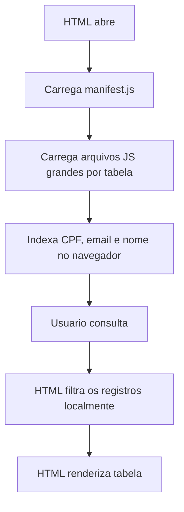
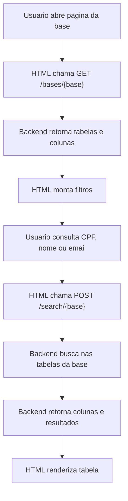

# Logica Antiga Adaptada para a Nova Estrutura

## Objetivo

Este documento descreve como aproveitar a logica dos arquivos antigos no novo desenho do projeto.

Contextos analisados:

- `../UNICO_miro.py`
- `../candidatos-grid-automacao-split-33k-js.zip`

A ideia antiga continua valida em varios pontos, mas precisa ser adaptada para as novas decisoes:

- As bases internas ficam separadas por pagina.
- Cada base possui suas proprias tabelas e colunas.
- O HTML nao deve carregar todas as bases como se fossem uma unica experiencia.
- A conexao deve passar pelo backend/API interna.
- A `UNICO People` continua com fluxo proprio.

## O que deve ser reaproveitado do HTML antigo

O HTML antigo tinha uma boa logica operacional para busca em massa. Devemos reaproveitar o conceito, nao necessariamente o mesmo arquivo.

Pontos reaproveitaveis:

- Manifesto de tabelas com `id`, `nome`, `colunas`, `partes` e quantidade de linhas.
- Filtro `Todas as tabelas`.
- Selecao de tabelas especificas.
- Busca por CPF, email e nome.
- Normalizacao de CPF removendo pontuacao e zeros decimais do Excel.
- Normalizacao de email em minusculo.
- Normalizacao de nome sem acentos e com espacos compactados.
- Indices separados por CPF, email e nome.
- Busca por nome exato e por tokens.
- Resultado em formato de planilha.
- Modo `Resumo` e modo `Todas as colunas`.
- Copia da tabela em formato TSV, proprio para colar em Excel/Sheets.
- Selecao de celulas como planilha.
- Coluna de link exibindo botao `Abrir link`, mas copiando a URL real.
- Indicadores de consultados, encontrados, ocorrencias e nao encontrados.

## O que muda na nova estrutura

Antes, o HTML carregava um pacote unico de dados e indexava tudo no navegador.

Agora, a logica deve ser dividida por base:

- Pagina `Consolidado` carrega apenas metadados e resultados do Consolidado.
- Pagina `Perifericos` carrega apenas metadados e resultados de Perifericos.
- Pagina `Processos Seletivos SP` carrega apenas metadados e resultados dessa base.
- Pagina `Processo Online` carrega apenas metadados e resultados dessa base.
- Pagina `GO Live & Takeover` carrega apenas metadados e resultados dessa base.
- Pagina `UNICO People` usa o fluxo da API UNICO.

O HTML deixa de ser responsavel por carregar arquivos gigantes de dados. Ele passa a:

1. Pedir ao backend quais tabelas existem na base aberta.
2. Montar os filtros dinamicamente.
3. Enviar a consulta ao backend.
4. Receber colunas e linhas prontas para renderizar.
5. Exibir e copiar a tabela.

## Fluxo antigo versus fluxo novo

### Fluxo antigo do HTML



### Fluxo novo recomendado



## Logica de entrada da busca

O campo de consulta deve aceitar multiplas entradas separadas por:

- Quebra de linha
- Virgula
- Ponto e virgula

Cada entrada deve ser classificada como:

- `cpf`, quando possuir digitos suficientes para CPF.
- `email`, quando possuir `@`.
- `nome`, quando nao for CPF nem email.

Regras de normalizacao:

- CPF: remover caracteres nao numericos, remover decimal `.0` vindo do Excel e completar com zero a esquerda quando necessario.
- Email: remover espacos e converter para minusculo.
- Nome: remover acentos, converter para minusculo e compactar espacos.

Tambem deve remover entradas repetidas da mesma consulta.

## Logica de busca nas bases internas

Para bases internas, a busca continua parecida com a antiga, mas executada pelo backend.

Regras:

- Buscar CPF no campo configurado como CPF da tabela.
- Buscar email no campo configurado como email da tabela.
- Buscar nome no campo configurado como nome da tabela.
- Quando nome tiver varias palavras, permitir busca por tokens.
- Retornar todas as linhas encontradas.
- Nao consolidar duplicados.
- Nao escolher melhor registro.
- Informar tabela/aba e linha de origem quando disponivel.

## Metadados necessarios por tabela

Cada tabela/aba deve informar:

- `id`
- `nome`
- `colunas`
- `cpfColumn`
- `nameColumn`
- `emailColumn`
- `sheetNameColumn`, quando existir
- `linkColumn`, quando existir
- quantidade de linhas, se disponivel

Exemplo:

```json
{
  "id": "cravinhos",
  "nome": "Cravinhos",
  "cpfColumn": "CPF",
  "nameColumn": "NOME COMPLETO",
  "emailColumn": "E-mail",
  "sheetNameColumn": "Nome da planilha",
  "linkColumn": "Link da aba",
  "colunas": ["Nome da planilha", "Link da aba", "NOME COMPLETO", "CPF", "E-mail"]
}
```

## Indices de busca

O conceito de indice continua importante, mas deve ficar no backend ou em uma camada intermediaria.

Indices recomendados por base:

- `cpfIndex`: CPF normalizado -> linhas encontradas.
- `emailIndex`: email normalizado -> linhas encontradas.
- `nameExactIndex`: nome normalizado completo -> linhas encontradas.
- `nameTokenIndex`: token de nome -> linhas candidatas.

Para nome:

1. Tentar busca exata pelo nome normalizado.
2. Se nao encontrar, quebrar o nome em tokens.
3. Considerar tokens com 2 ou mais caracteres.
4. Retornar linhas que contenham todos os tokens.

## Resultado para o HTML

O retorno deve continuar parecido com o grid antigo:

- `Consulta`
- `Tipo`
- `Resultado`
- `Tabela`
- `Linha`
- Colunas da base

Exemplo:

```json
{
  "colunas": ["Consulta", "Tipo", "Resultado", "Tabela", "Linha", "Nome da planilha", "Link da aba", "NOME COMPLETO", "CPF", "E-mail"],
  "linhas": [
    ["12345678900", "CPF", "Encontrado", "Cravinhos", 25, "Cravinhos", "https://...", "Nome Exemplo", "12345678900", "exemplo@email.com"]
  ]
}
```

Para itens nao encontrados, retornar linha com:

- `Consulta`
- `Tipo`
- `Resultado = Nao encontrado`
- Demais campos vazios

## Colunas resumo e todas as colunas

O modo antigo tinha `Resumo` e `Todas as colunas`. A nova versao deve manter isso.

Modo `Resumo`:

- Exibe apenas colunas principais configuradas para a base.
- Deve variar conforme a base, porque as colunas mudam.

Modo `Todas as colunas`:

- Exibe todas as colunas retornadas pela tabela/aba.

O backend pode retornar:

```json
{
  "colunas_resumo": ["Nome da planilha", "Link da aba", "NOME COMPLETO", "CPF", "E-mail", "STATUS"],
  "colunas_todas": ["..."]
}
```

## Copia da tabela

Manter a logica antiga:

- Copiar em TSV, com colunas separadas por tabulacao.
- Permitir copiar tabela inteira.
- Permitir copiar selecao de celulas.
- Para links, copiar a URL real.
- Nao copiar o texto `Abrir link`.

## Link da aba

Manter comportamento antigo:

Na tela:

- Se a coluna for de link e o valor for URL, exibir botao `Abrir link`.

Na copia:

- Usar a URL original.

## Logica antiga da UNICO adaptada

O script `UNICO_miro.py` confirma varias regras que devem continuar:

- Limpar CPF antes da consulta.
- Consultar a endpoint de pessoas por CPF.
- Validar erro de autenticacao.
- Tratar rate limit.
- Calcular acesso recente por data limite ou data de documentos.
- Aplicar filtro por dias.
- Escolher o melhor acesso quando houver mais de um.
- Extrair nome, CPF, email, status, pendencias, data e numero de ocorrencias.
- Gerar saida tabular.

Adaptacoes para a nova versao:

- A busca UNICO deve acontecer a partir da pagina `UNICO People`.
- O HTML envia as entradas e filtros ao backend.
- O backend executa as chamadas para a UNICO.
- O backend devolve resposta no mesmo formato de tabela usado pelas demais paginas.
- A credencial pode ser informada na tela, mas nao deve ser gravada em log.

## Regra de pendencias da UNICO

O script antigo considera pendencia quando:

- `code != 220`, ou
- `exist` e `false`.

Para a nova versao, a regra recomendada e seguir a logica antiga validada pelo uso:

- Para status `Arquivado`: pendencias em branco.
- Para status `Mesa de analise`: `Assinatura de documento`.
- Para status `Pendente`: listar documentos pendentes conforme `code != 220` ou `exist == false`.
- Para status `Nao iniciado`: `Todos os documentos`.

## Decisao final

O novo sistema deve parecer operacionalmente com o antigo para o usuario, mas tecnicamente sera mais organizado:

- Antigo: uma tela carregando todas as tabelas em arquivos JS.
- Novo: paginas separadas por base, consultando backend.
- Antigo: indices no navegador.
- Novo: indices no backend/API.
- Antigo: dados empacotados no HTML.
- Novo: dados servidos conforme a base aberta.
- Mantido: busca em massa, filtros, tabela estilo Excel, copia TSV, link como botao e UNICO com regra propria.
